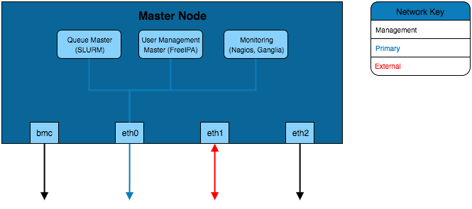
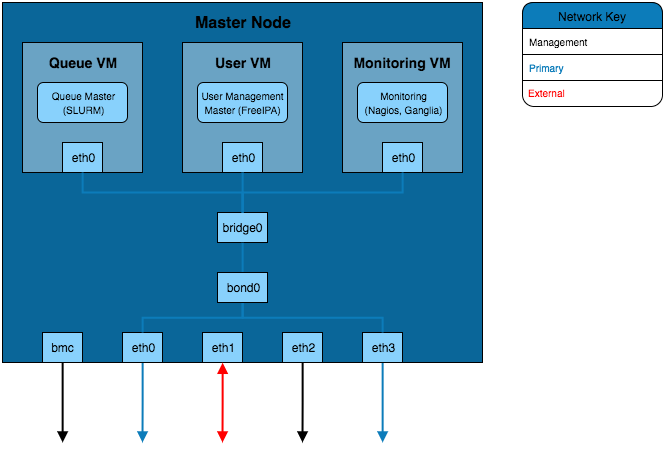
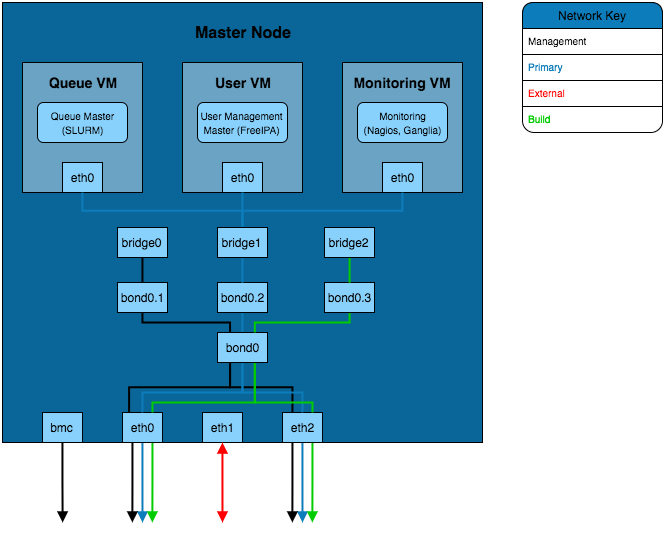

.. _infrastructure-guidelines:

Recommendations for Infrastructure Design
=========================================

The example configurations here combine the elements of the examples from :ref:`network-hardware-guides` as well as the different infrastructure solutions from :ref:`infrastructure-considerations`. These focus on the internal configuration of the master node but these examples can be extrapolated for configuring login, storage, compute or any other nodes that are part of the HPC environment.

Simple Infrastructure
---------------------

The simplest infrastructure configuration uses the all-in-one approach where services are configured on the master node's operating system.

Virtual Machine Infrastructure
------------------------------

.. image:: InfrastructureDesign2.png
    :alt: Infrastructure Design Example 2

This solution separates the services into VMs sat on the master node. In order for these VMs to be able to connect to the primary network a network bridge is created that allows the VM interfaces to send traffic over the eth0 interface.

Channel Bonded Infrastructure
-----------------------------

This example adds a layer of redundancy over the *VM Infrastructure* design by bonding the eth0 and eth3 interfaces. These interfaces are connected to separate network switches (the switches will be bridged together as well) which provides redundancy should a switch or network interface fail. Bonding of the two interfaces creates a new *bond* interface that the bridge for the virtual machines connects to. 

VLAN Infrastructure
-------------------

The above solution implements the channel bonded infrastructure in a network with VLANs configured. The VLANs have bond and bridge interfaces created for them. This allows some additional flexibility for VM bridging as interfaces can have interfaces bridged onto specific VLANs. This adds additional security to the network as the master node can be left without an IP on certain VLAN bond interfaces which prevents that network from accessing the master node whilst VMs on the master node are able to reach that VLAN.