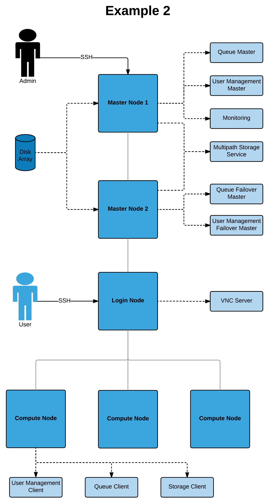
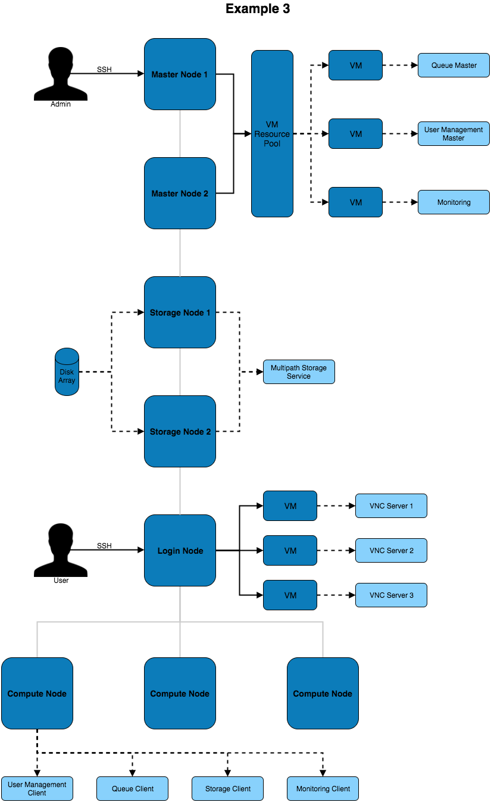
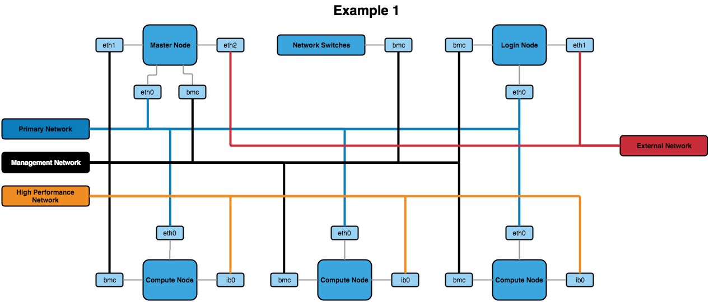

.. _network-hardware-guides:

Recommendations for Network and Hardware Design
===============================================

At Alces software, the recommended network design differs slightly depending on the number of users and quantity of systems within the HPC platform. 

Cluster Architectures
---------------------

With the :ref:`Network and Hardware Design Considerations<network-hardware-considerations>` in mind, diagrams of different architectures are below. They increase in complexity and redundancy as the list goes on.

Example 1
^^^^^^^^^

.. image:: NodeTypes1.png
    :alt: Node Types Example 1

The above architecture consists of master, login and compute nodes. The services provided by the master & login nodes can be seen to the right of each node type. This architecture only separates the services for users and admins.

Example 2
^^^^^^^^^

This architecture provides additional redundancy to the services running on the master node. For example, the disk array is connected to both master nodes which use multipath to ensure the higher availability of the storage device. 

Example 3
^^^^^^^^^

This architecture puts services inside of VMs to improve the ability to migrate and modify services with little impact to the other services and systems on the architecture. Virtual machines can be moved between VM hosts live without service disruption allowing for hardware replacements to take place on servers.

Network Designs
---------------

The above architectures can be implemented with any of the below network designs.

Example 1
^^^^^^^^^

The above design contains the minimum recommended internal networks. A primary network (for general logins and navigating the system), a management network (for BMC management of nodes and switches) and a high performance Infiniband network (connected to the nodes). The master and login nodes have access to the external network for user and admin access to the HPC network.

.. note:: The master node could additionally be connected to the high performance network so that compute nodes have a faster network connection to storage.

Example 2
^^^^^^^^^
