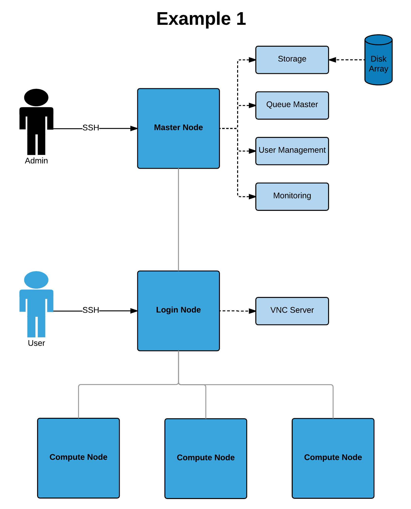

.. _network-hardware-guides:

Recommendations for Network and Hardware Design
===============================================

At Alces software, the recommended network design differs slightly depending on the number of users and quantity of systems within the HPC platform. 

Network Designs
---------------

With the :ref:`Network and Hardware Design Considerations<network-hardware-considerations>` in mind, diagrams of different networks are below. They increase in complexity and redundancy as the list goes on.

Example 1
^^^^^^^^^

The above network consists of master, login and compute nodes. The services provided by the master & login nodes can be seen to the right of each node type. This network only separates the services for users and admins.

Example 2
^^^^^^^^^
