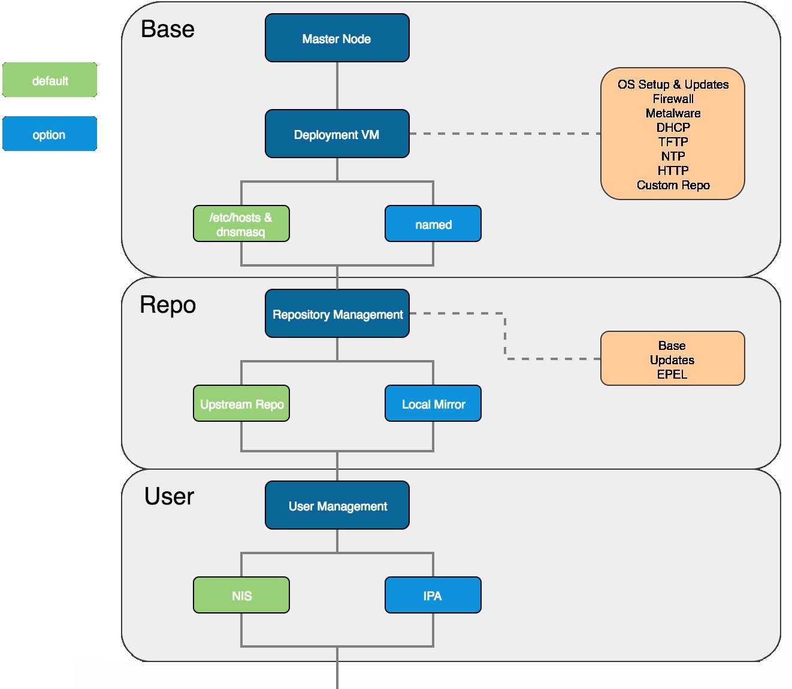
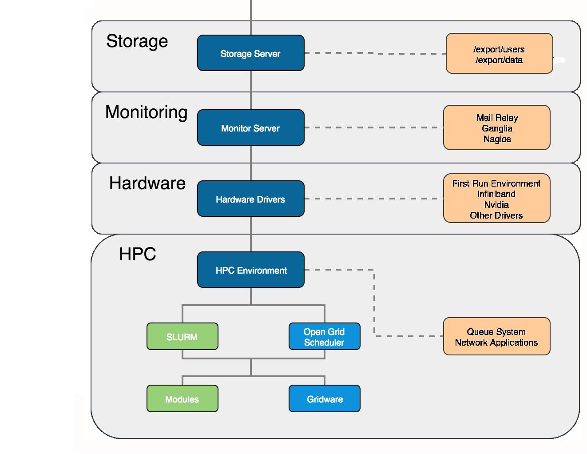

.. _overviews:

Overviews
=========

A successful  HPC cluster environment is composed of a number of different packages. When designing your system, a range of different components can be chosen to enable different functionality, features and capabilities to be implemented. Your choice of packages will depend on your specific requirements - the diagram below shows an example breakdown of the different sections reviewed in this document which can be used to build a complete HPC system::

    

    
