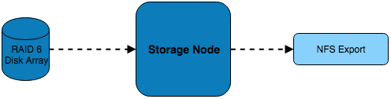
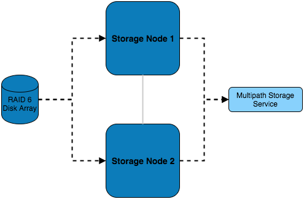
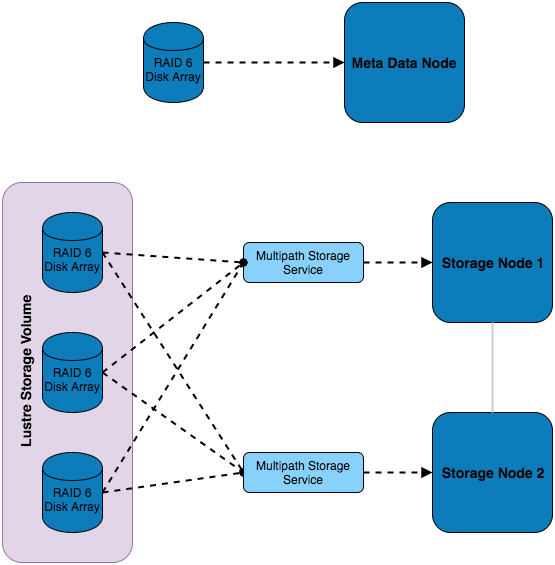

.. _storage-considerations:

Considerations for Storage Solution
===================================

Storage Hardware
----------------

When selecting the storage solution it is worth considering the size, performance and resilience of the desired storage solution. Usually some sort of storage array will be used; e.g. a collection of disks (otherwise known as JBOD - Just a Bunch Of Disks) in the form of an internal or external RAID array.

Type of filesystem
------------------

For many requirements, a simple NFS solution can provide sufficient performance and resiliency for data. Application, library and source-code files are often small enough to be stored on an appropriately sized NFS solution; such storage systems can even be grown over time using technologies like LVM and XFS as requirements increase. 

For data-sets that require high capacity (>100TB) or high-performance (>1GB/sec) access, a parallel filesystem may be suitable to store data. Particularly well suited to larger files (e.g. at least 4MB per storage server), a parallel filesystem can provide additional features such as byte-range locking (the ability for multiple nodes to update sections of a large file simultaneously), and MPI-IO (the ability to control data read/written using MPI calls). Parallel filesystems work by aggregating performance and capacity from multiple servers and allowing clients (your cluster compute and login nodes) to mount the filesystem as a single mount-point. Common examples include:

 - Lustre; an open-source kernel-based parallel filesystem for Linux
 - GPFS (general purpose file system; a proprietary kernel-based parallel filesystem for Linux
 - BeeGFS; an open-source user-space parallel filesystem for Linux
 
Your choice of filesystem will depend on the features you require, and your general familiarity with the technologies involved. As parallel filesystems do not perform well for smaller files, it is very common to deploy a parallel filesystem alongside a simple NFS-based storage solution.

If your data-set contains a large number of files which need to be kept and searchable for a long time (> 12-months) then an object storage system can also be considered. Accessed using client-agnostic protocols such as HTTPS, an object storage system is ideal for creating data archives which can include extended metadata to assist users to locate and organise their data. Most object storage systems include data redundancy options (e.g. multiple copies, object versioning and tiering), making them an excellent choice for long-term data storage. Examples of object-storage systems include:

- AWS Simple Storage Service (S3); a cloud-hosted service with a range of data persistence options
- Swift-stack; available as both on-premise and cloud-hosted services, the SWIFT protocol is compatible with a wide range of software and services
- Ceph; an on-premise object storage system with a range of interfaces (block, object, S3, POSIX file)

Network Storage Solutions
-------------------------

Single server with NFS
^^^^^^^^^^^^^^^^^^^^^^

In this example, a single server is connected to a RAID 6 storage array which it is serving over NFS to the systems on the network. While simple in design and implementation, this design only provides redundancy at the RAID level.

Multiple Servers with NFS
^^^^^^^^^^^^^^^^^^^^^^^^^

In addition to the previous example, this setup features multiple storage servers which balance the load of serving the disk over NFS.

Multiple Servers with Parallel filesystem
^^^^^^^^^^^^^^^^^^^^^^^^^^^^^^^^^^^^^^^^^

This setup features multiple RAID sets which are installed externally to the storage servers and are connected to both of them using multipath - this allows for multiple paths to the storage devices to be utilised. Using this storage, a Lustre volume has been configured which consists of a combination of all the external disks. Authorisation of access to the storage volume is managed by the metadata node, which also has dedicated storage.

Additional Considerations and Questions
---------------------------------------

  - What data will need to be centrally stored?
  - Where will data be coming from?
  
    - Are source files created within the HPC network or do they exist in the external network?
    - Will compute nodes be writing out logs/results from running jobs?
    - Where else might data be coming from?
    
  - Is scratch space needed?
  - What level of redundancy/stability is required for the data?
  - How will the data be backed up?
  
    - Will there be off-site backups?
    - Should a separate storage medium be used?
    - Does all the data need backing up or only certain files?
    - For how long will we keep the data, and any backups created?
    
  - What are my disaster recovery and business continuity plans?
  
    - If the storage service fails, how will my users continue working?
    - How can I recreate the storage service if it fails?
    - How long will it take to restore any data from backups?
